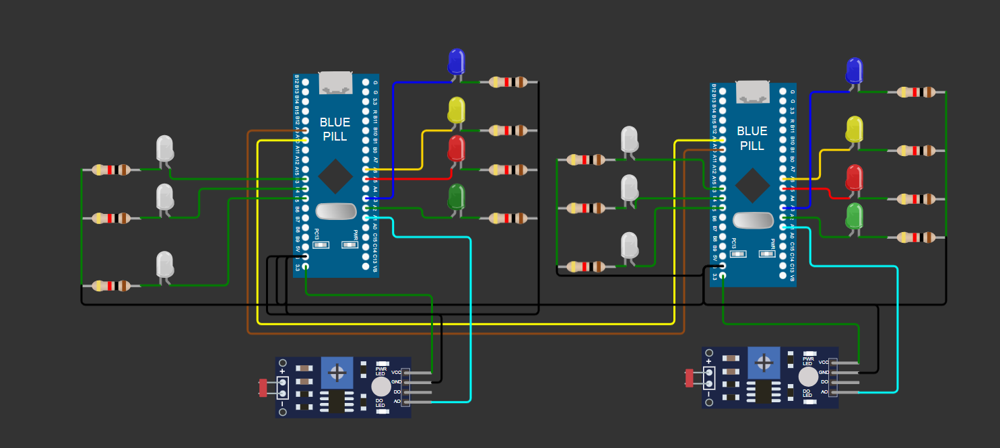

# STM32 USART Light Intensity Communication Project

This project demonstrates communication between two STM32F103C6 microcontrollers via USART, based on ambient light sensing using a photoresistor. One board acts as the sensor node, and the other as the receiver/display node.

## Overview

- The first STM32 reads light intensity from a photoresistor using its ADC and categorizes it into:
  - High light
  - Medium light
  - Low light
- It sends this classification (`'a'`, `'b'`, or `'c'`) to the second STM32 via USART.
- The second STM32 receives the data and controls LEDs to visually represent the brightness level.

## Working Principle

1. Initialization:
   - Clock, GPIO, ADC, USART, and SysTick timers are configured.
2. Main Loop:
   - ADC samples light intensity (via PA1).
   - Brightness is classified:
     - `'a'`: High brightness
     - `'b'`: Medium brightness
     - `'c'`: Low brightness
   - Classification is sent via USART1.
   - Incoming USART data is received and LEDs are controlled accordingly.
   - Heartbeat LED on PA3 blinks to indicate loop activity.

## Hardware Setup

### Sensor Node (Transmitter STM32)

| Pin  | Direction | Mode                         | Role                           |
|------|-----------|------------------------------|--------------------------------|
| PA1  | Input     | Analog Input                 | Photoresistor (ADC input)      |
| PA2  | Output    | GPIO Push-Pull               | TXE status indicator (LED)     |
| PA3  | Output    | GPIO Push-Pull               | Heartbeat indicator            |
| PA9  | Output    | Alternate Function Push-Pull | USART1 TX                      |
| PA10 | Input     | Floating Input               | USART1 RX                      |

### Receiver Node (Receiver STM32)

| Pin  | Direction | Mode                         | Role                             |
|------|-----------|------------------------------|----------------------------------|
| PB6  | Output    | GPIO Push-Pull               | LED1 – Low/Med/High              |
| PB7  | Output    | GPIO Push-Pull               | LED2 – Med/High                  |
| PB5  | Output    | GPIO Push-Pull               | LED3 – High only                 |
| PA5  | Output    | GPIO Push-Pull               | RXNE status indicator (LED)      |
| PA6  | Output    | GPIO Push-Pull               | Optional message success LED     |
| PA3  | Output    | GPIO Push-Pull               | Heartbeat indicator              |
| PA9  | Output    | Alternate Function Push-Pull | USART1 TX                        |
| PA10 | Input     | Floating Input               | USART1 RX                        |

## LED Output Logic

| Classification | LEDs ON (PB6, PB7, PB5) | Brightness Level |
|----------------|-------------------------|------------------|
| `'a'`          | All 3 ON                | High             |
| `'b'`          | PB6, PB7 ON             | Medium           |
| `'c'`          | PB6 ON only             | Low              |

## Code Overview

### Key Files

- `main.c` – Contains the core logic for reading ADC, sending/receiving USART data, and controlling GPIOs.

### Important Functions

- `En_clock()` – Enables necessary peripheral clocks.
- `gpio_setup()` – Configures GPIO pins for analog input, USART, and LEDs.
- `Uart_config()` – Configures USART1 for 9600 baud communication.
- `ADC_config()` – Sets up ADC1 for continuous conversion from channel 1 (PA1).
- `systick_config()` – Configures SysTick for millisecond delays.
- `delay()` – Busy-wait delay using SysTick.
- `main()` – Application loop: read ADC, classify, communicate, and control LEDs.

## Requirements

- 2x STM32F103C6 Boards (e.g., Blue Pill)
- STM32Cube Programmer or ST-Link Utility
- UART connection between both boards (PA9 ↔ PA10)
- 3 LEDs with resistors
- Breadboard and jumper wires
- Light sensor (photoresistor with resistor divider to PA1)

## Notes

- The code uses bare-metal C and direct register access (no HAL/LL libraries).
- Ensure both STM32 boards share a common GND for USART to work properly.
- The `debounce()` function is included but not actively used.

## Circuit Diagram

## License

This project is for educational purposes. You are free to use and modify it as needed.

## Contributions

Contributions, issues, and suggestions are welcome. Feel free to fork this repo and submit pull requests.

